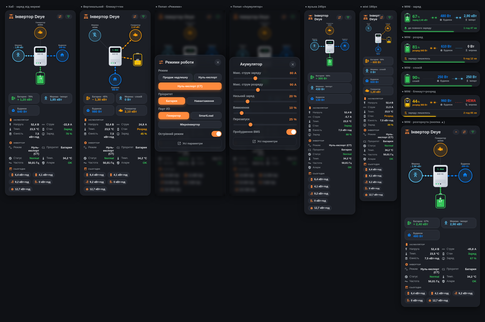

<div align="center">

# 🔋 jbd-bms-toolkit

**Talk to JBD LiFePO4 BMS over RS485, publish everything to Home Assistant, keep parallel packs balanced and their SOC in sync.**

*[Українська версія](README.uk.md)*




</div>

---

## What this is

A battle-tested toolkit born from running **two parallel 16S LiFePO4 packs** (≈150 Ah each)
on a **Deye SUN-5K-SG03LP1** hybrid inverter, with two *different* JBD BMS generations on
one RS485 bus:

| Pack | BMS | Protocol for writes |
|------|-----|---------------------|
| A ("old") | JBD **UP16S010**, address 0 | classic JBD **DD** frames (`DD A5/5A … 77`) |
| B ("new") | JBD **UP16S019 rev.2** (LS firmware), address 1 | **ES-UP Modbus** (`0x78`/`0x79`) — DD writes are silently ignored |

Everything here was reverse-engineered, verified on live hardware and then used in
production 24/7. The docs include the mistakes too, so you don't have to repeat them.

## Features

- **`jbd2mqtt`** — daemon: polls every pack (cells, temps, current, SOC, balancing bits,
  protections) → MQTT with **Home Assistant discovery** (devices appear automatically),
  shared LWT + per-pack availability.
- **Balancing-mode follower** — JBD passive balancers balance *either* while charging *or*
  at rest, never both. The daemon switches each pack to the mode that is useful right now
  (charge vs static), with hysteresis, debounce and write rate-limits.
- **"Top spread" metric** — cell spread measured only on the upper knee (≥3.45 V), the one
  number that tells you if the pack is really drifting apart.
- **`jbd_settings`** — dump / back up / write BMS settings over DD with persistence check
  (fresh-session re-read), current calibration (`0xAD-0xAF`), **remaining-capacity write
  (`0xE0`)** to fix a wrong SOC.
- **`esup`** — ES-UP Modbus access for rev.2 firmware: balance mode, remaining capacity,
  cycle counter, **per-cell voltage gain calibration** (the "it's vendor-locked" myth was
  just wrong write addressing — see the docs).
- **Home Assistant automations** — cell over-voltage guard (stop before BMS OVP),
  balance-hold cycle, night balance guard, slow nightly top-up to 100 %.
- **Lovelace card** — inverter + 2 BMS dashboard with animated per-cell balancing, mode
  selector, charts tab, outage-schedule tab.
- **Deployment** — systemd unit, udev rule, Docker/compose, `.env` config.

## Quick start

```bash
git clone https://github.com/alexbadcat/jbd-bms-toolkit.git /opt/jbd-bms-toolkit
cd /opt/jbd-bms-toolkit
python3 -m venv .venv && . .venv/bin/activate
pip install -r requirements.txt
python3 src/jbd_bms.py            # first read — check the wiring
cp jbd2mqtt.env.example jbd2mqtt.env && nano jbd2mqtt.env
python3 src/jbd2mqtt.py           # devices show up in Home Assistant
```

➡️ **Full step-by-step guide (wiring → service → HA → card → troubleshooting):
[docs/installation.md](docs/installation.md)**

## Documentation

| Doc | What's inside |
|-----|---------------|
| [Installation](docs/installation.md) | 13 numbered steps from zero to a running system |
| [JBD DD protocol](docs/protocol-jbd-dd.md) | frame format, service mode, register table, `0x2D` bits, calibration, `0xE0`, SOC=100 % rule |
| [ES-UP protocol](docs/protocol-es-up.md) | rev.2 firmware: Modbus blocks, DV/DP mode, index-addressed calibration writes |
| [Balancing](docs/balancing.md) | passive-balancer physics, charge vs static mode, follower logic, real 374 → 18 mV recovery case |
| [SOC calibration](docs/soc-calibration.md) | why parallel packs' SOC drifts apart and how to fix it |
| [Home Assistant](docs/home-assistant.md) | sensors, availability, automation examples explained |
| [Lovelace card](lovelace-card/README.md) | install & full config |
| [Lessons learned](docs/lessons-learned.md) | bus collisions, "accepted ≠ saved", Deye quirks |
| [Safety](docs/safety.md) | **read before writing anything to a BMS** |

## Repository layout

```
src/                  daemon, BMS protocol libraries, CLI tools
tests/                pytest suite (balancing follower, top-spread metric)
deploy/               systemd unit, udev rule, Docker
examples/             Home Assistant automations + helpers, ser2net
lovelace-card/        custom dashboard card
docs/                 everything above, English + Ukrainian
```

## ⚠️ Disclaimer

Writing to a BMS can disable protections or brick it. Back up settings first, never touch
protection thresholds you don't understand, verify every write. You use this at your own
risk — see [docs/safety.md](docs/safety.md).

## Support

If this saved your batteries (or your weekend) — buy me a beer 🍺 or donate to the
Armed Forces of Ukraine 🇺🇦:

<a href="https://send.monobank.ua/jar/8FCf878bY4"></a>

**☕ [send.monobank.ua/jar/8FCf878bY4](https://send.monobank.ua/jar/8FCf878bY4)**

---

<div align="center">

MIT © alexbadcat · **Слава Україні! 🇺🇦**

</div>
